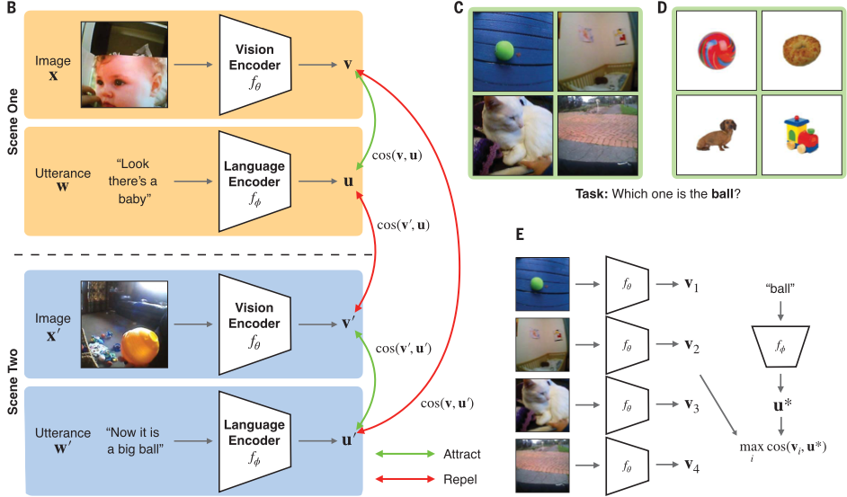

# CVCL2024-repro



This code tries to reproduce the 2024 Vong, W. K. et al. paper: [Grounded language acquisition through the eyes and ears of a single child](https://www.science.org/doi/abs/10.1126/science.adi1374). This study uses a CLIP-like Model trained on visual-linguistic data([SAYCam-S](https://pubmed.ncbi.nlm.nih.gov/34485795/)) from a single child to show how basic representation can be learned from infant's everyday sensory input.

### Prerequisites

#### Prepare dataset

Since we don't have the direct access to exact [SAYCam-S](https://pubmed.ncbi.nlm.nih.gov/34485795/) dataset that was used in the paper, but this paper provide generalization example on [KonkObject](http://olivalab.mit.edu/MM/archives/ObjectCategories.zip) dataset(["Massive Memory" Object Categories](https://konklab.fas.harvard.edu/#)), we follow their way to prepare the data and evaluate the model for zero-shot object recognition under a [special setting](####trial-zero-shot).

1. Download the [KonkObject](http://olivalab.mit.edu/MM/archives/ObjectCategories.zip) dataset and [Classes](http://olivalab.mit.edu/MM/downloads/MM2-Ranks.xls).
2. Update paths in run.sh.

#### Trial Zero-shot: A Special Setting
In contrast traditional generalized zero-shot learning, this study define zero-shot "trials" as follows:
1. Select 4 images as 1 trial. 1 image is the target image and the other 3 images are foil images.
2. Pass 4 images and 1 target label to the CVCL model.
3. Get max similarity score in this 4-choose-1 trial.

#### Generate Trials 
We generate trials for the KonkObject dataset as described in the supplementary materials, producing 5 trials per image and 85 trials per category, 5440 trials in total. Details can be found in `generate_trials.py`.

### Run

To reproduce the classficiation and generalization examples on generate trials and get zero-shot-trial results, run the following command:

```bash
$ ./run.sh
```
Results can be found in `results` folder.

#### Repro Class-wise Accuracy
After running `run.sh`(run on 5 seeds), use `repro_plt.ipynb` to reproduce the class-wise accuracy as shown in the original study (Fig.3.A).


In repro plt:
1. Get box plt of class-wise accuracy of CVCL for 5 seeds.
2. Get CLIP & CVCL's total accuracy by avg of 5 seeds for comparison.


#### Repro Genralization Example

For generalization examples (Fig.3.B), run the corresponding section in `repro_plt.ipynb`.


In repro plt:
1. Maually select examples appear in the paper, filter out the corresponding trials. 
2. Get each images zero-shot-trial results and avg for each img get results.


### Open questions
- Why repro class-wise accuracy is different from the paper? Especially the Order of classes.
  - Is it due to our homemade way of generating trials?
- Given order is different, the distribution and trend of class-wise accuracy are very similar to the paper.
  - Around 1/2 classes performance are close to the baseline(25%).
- How to reproduce the exact generalization examples' score in the paper?
  - Since we are doing avg on 5 trials of each images, we can't reach the same score as the paper.(e.g. 53.3%)
    

